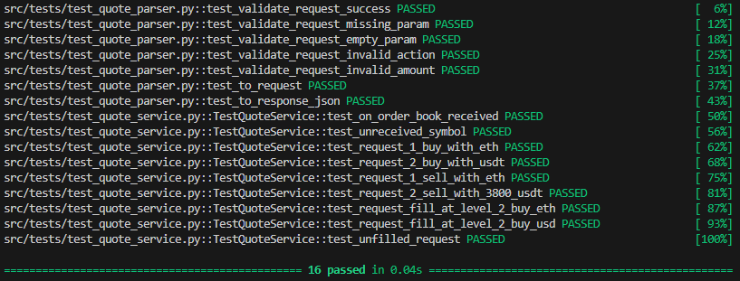

# quote

## Description
A brief description

## Architecture


## Installation

1. Clone the repository:
    ```bash
    git clone https://github.com/alp-c/quote.git
    cd quote
    ```

2. (Optional) Create and activate a virtual environment:
    ```bash
    python -m venv env
    ```
    on windows
    ```
    env\Scripts\activate
    ```
    on linux
    ```
    source env/bin/activate
    ```

3. Install the required packages:
    ```bash
    pip install -r requirements.txt
    ```

## Usage

Current configuration (can be changed at src/app.py)
```python
# Quote requests will be served at this port
port = 5021  

# This symbols' partial order book data will be listened from binance spot web-socket
# and can be used to make quote request
symbols = ["BTCUSDT", "ETHUSDT", "LTCUSDT", "BNBUSDT", "USDTTRY"]
```
Start service
```bash
python src/app.py
```
at another terminal window send request to service (tested and works on windows)
```bash
curl -X POST http://localhost:5021/quote -H "Content-Type: application/json" -d "{\"action\": \"buy\", \"base_currency\": \"ETH\", \"quote_currency\": \"USDT\", \"amount\": \"1.5\"}"
```
Received response
```json
{"currency":"USDT","price":"3185.6","total":"4778.4"}
```


## Executing Tests
at current repository folder just run
```bash
pytest
```
unit test results


Tested on Python 3.11.4 and Python 3.9.17