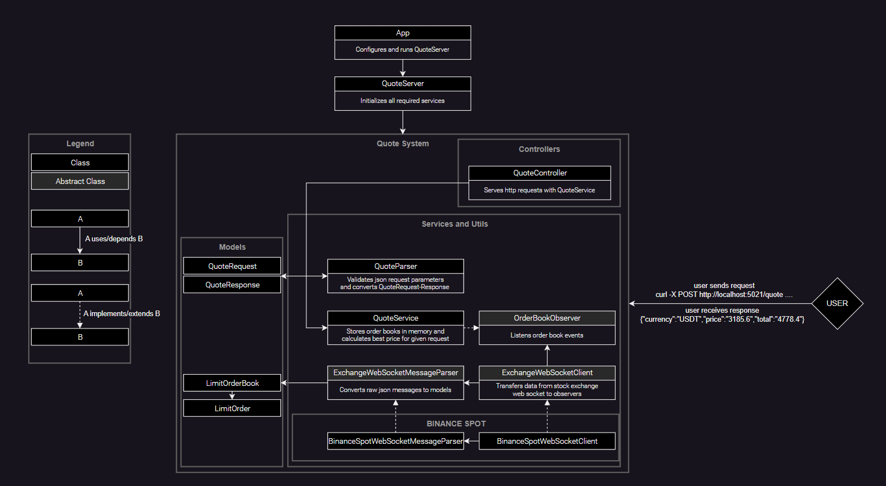

# quote

## Description
A brief description

## Architecture



## Installation

1. Clone the repository:
    ```bash
    git clone https://github.com/alp-c/quote.git
    cd quote
    ```

2. (Optional) Create and activate a virtual environment:
    ```bash
    python -m venv env
    source env/bin/activate  # On Windows use `env\Scripts\activate`
    ```

3. Install the required packages:
    ```bash
    pip install -r requirements.txt
    ```

## Usage

```bash
python src/app.py
```

Current configuration (can be changed at src/app.py)
```python
# Quote requests will be served at this port
port = 5021  

# This symbols' partial order book data will be listened from binance spot web-socket
# and can be used to make quote request
symbols = ["BTCUSDT", "ETHUSDT", "LTCUSDT", "BNBUSDT", "USDTTRY"]
```


## Executing Tests
```bash
cd quote # set working directory to current repository folder
pytest
```


Tested on Python 3.11.4 and Python 3.9.17